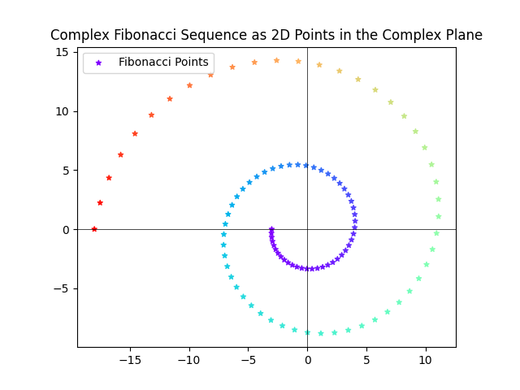

# Fibonacci Spiral Visualization

This repository explores an intriguing visualization of the Fibonacci sequence using matrix exponentiation and eigenvalue decomposition. By introducing the imaginary unit \(i\) to the eigenvalue matrix, a fascinating spiral loop of Fibonacci points is created.

## Visualization

The Fibonacci points in the spiral are generated by raising a modified diagonal matrix to the power of \(n\). The visual representation of this spiral can be seen in the image below.

